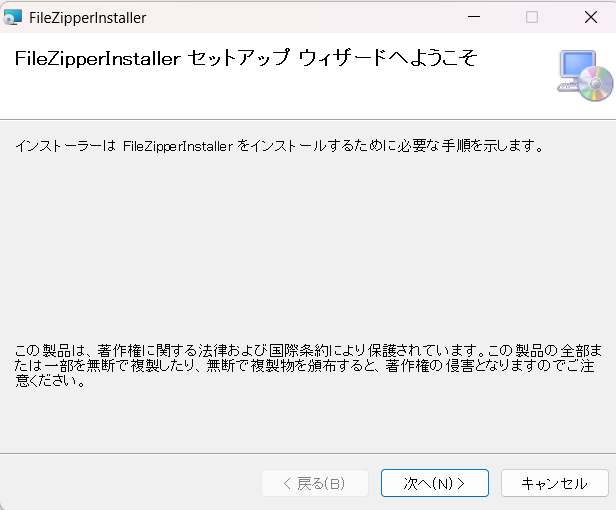
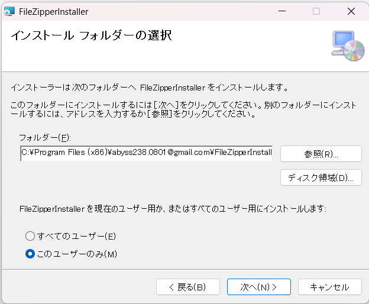
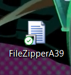
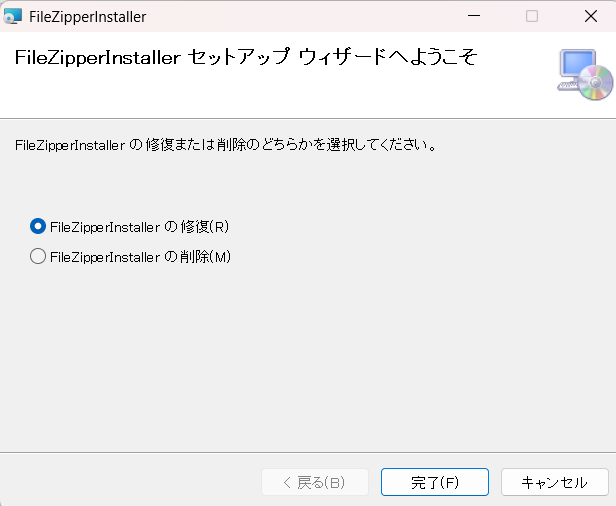

# 目次

* [Compression](#Compression)  
* [このプログラムは...](#このプログラムは)
* [使用方法](#使用方法)
* [消したい・・・](#消したい)
* [実際に使ってみる](#実際に使ってみる)
* [最後に・・・](#最後に)

# Compression  
---
## このプログラムは...  
実行時に出てくるウィンドウにVisual Studioのフォルダを入れることによって  
その中のC++ファイル、  
C#ファイル、  
ヘッダーファイル、  
exeファイルを検知し  
それらを名前を変えながら圧縮ができるプログラムです。  
---
2025/05/30/3:21  
インストーラーにしました！

# 使用方法  
---
ダウンロードしたら実行フォルダを開いて・・・  
インストーラーを起動したら「次へ」を押ます。  
  
  
  
    
実行ファイルをどこに入れるか聞かれるので好きな場所に入れてくれ～    
  
  
   
    
## 「次へ」を押して・・・  
これ以降は許可を求められるので、許可をすれば！  
自分が選択した場所にFileZipperA39が追加されれば完了！  
  
  
  
    
## 消したい...
消したい場合はもう一度インストーラーの方を探して実行すれば  
こんな感じのが↓  
  
  
これで削除完了！  
  
  
## 実際に使ってみる
この四角の中にvisual studioのフォルダを入れて・・・  
  
  
ここに圧縮したいフォルダを何処に入れるかを参照・・・  
  
  
  
ここにフォルダネームを記入して…  
  
  
  
リネーム実行！  
  
  
  
## 最後に・・・  
聞きたいことや質問・コードの解説(気が向いたら)はAT12A_39まで！

  
